# b-it-bots Robothon® 2023 Team Report
This repository contains the code and documentation of our approach used for the [Robothon® 2023 challenge](https://automatica-munich.com/en/munich-i/robothon/).

Our team, b-it-bots, is from the Institute for AI and Autonomous Systems ([A<sup>2</sup>S](https://h-brs.de/en/a2s)) at Hochschule Bonn-Rhein-Sieg, Germany.


<p align="center">
  
  
  <br></br>
</p>

# Platform
We use the 7-dof Kinova Gen3 with a Robotiq 2F-85 gripper. The arm comes with a wrist-mounted RealSense depth module, which provides an RGB and depth stream. Additionally, the joint torques are used to estimate the force and torque at the end-effector. We use an Intel NUC with an Intel Core i7 processor as the main computer. A 3D printed part shown below is used to hold the multimeter probe. We attach foam to the gripper fingers and connect the fingers with a zip tie for manipulating the probe cable.

* [7-dof Kinova Gen3 Arm with Intel RealSense Depth Module 410](https://www.kinovarobotics.com/product/gen3-robots)
* [Robotiq 2F-85 adaptive gripper](https://robotiq.com/products/2f85-140-adaptive-robot-gripper) with foam and zip tie attached to the fingers (see image below)
* [Intel NUC](https://www.intel.com/content/www/us/en/products/sku/190109/intel-nuc-9-extreme-kit-nuc9i7qnx/specifications.html) with an Intel Core i7 processor, and 8 GB of RAM
* [3D printed multimeter probe holder](docs/3d_models/probe_holder_v3.STL)

<p float="left">
  
  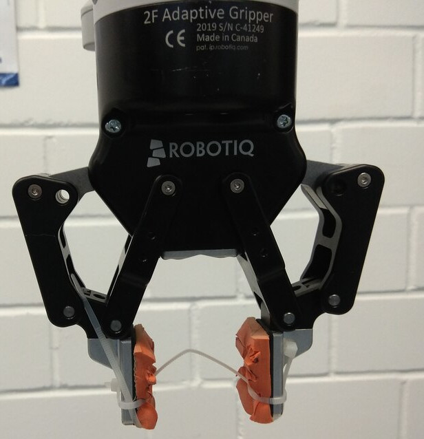
  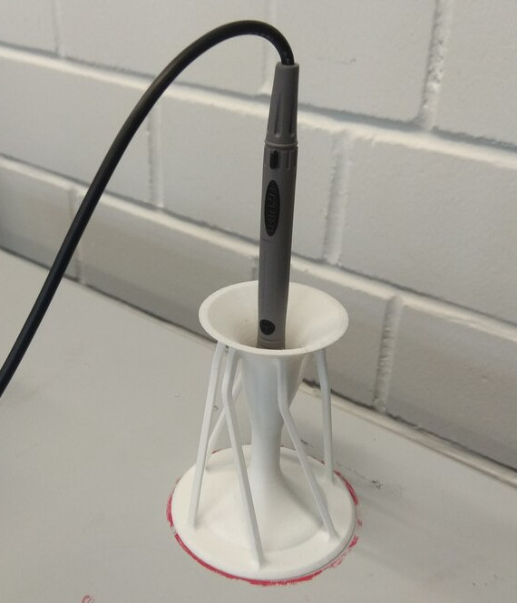
</p>


# Quick Start Guide
## Dependencies
We use Ubuntu 20.04 / Pop! OS 20.04 as the operating system, with ROS Noetic for interprocess communication.
### ROS dependencies
- [kortex](https://github.com/Kinovarobotics/kortex)
- [ros_kortex](https://github.com/Kinovarobotics/ros_kortex)
- [ros_kortex_vision](https://github.com/Kinovarobotics/ros_kortex_vision)
- [cv_bridge](http://wiki.ros.org/cv_bridge)
- ros-noetic-pcl-ros
- ros-noetic-perception-pcl

### Additional Python dependencies
Apart from standard Python packages and the ROS Python packages, the following packages are needed (can be installed via `pip3 install`:
- opencv-python
- scipy
- PyQt5
- yolov5
- Tkinter
- Pyperclip
- pytesseract

## Setup the robot

1. Connect an ethernet cable from the robot to the computer
2. Open Settings -> Network -> Wired (click on setting icon) -> Go to IPv4 -> Click on "Manual" IPv4 Method -> Under Addresses, in Address, type `192.168.1.10` | in Netmask, type `255.255.255.0` -> Apply
3. On the browser (Chrome), type URL `192.168.1.12` (assuming the address of the robot is configured to 192.168.1.12)
4. Username: admin, Password: <type-password-here>

## Update launch file

1. roscd kortex_driver/launch
2. Open kortex_driver.launch
3. Change the IP address to `192.168.1.12`
4. Change password to the password you set
5. Add default gripper, it should look like this (line 13) `<arg name="gripper" default="robotiq_2f_85" if="$(eval arg('arm') == 'gen3')"/>`
6. Change the IP address to `192.168.1.12` (line 3) in `kinova_vision_rgbd.launch` file

## Launch

Run each of the following in separate terminals:

```
roscore
roslaunch kortex_driver kortex_driver.launch
roslaunch kinova_vision kinova_vision_rgbd.launch
roslaunch robothon2023 task_sm.launch
```

Visualize debug images and TF tree in RViz using [config/robothon.rviz](config/robothon.rviz)

#### Expected behaviour
* The robot moves above the board
* The robot finds the board, reorients, and finds the board again
* The robot completes the tasks specified by the [task_order](config/task_params.yaml) parameter

### Testing
For testing individual components, you may want to launch the `task_board_detector` separately. Launch it as follows, and publish two `e_start` messages:
```
roslaunch robothon2023 task_board_detector.launch
rostopic pub /task_board_detector/event_in std_msgs/String e_start
rostopic pub /points_of_interest_publisher/event_in std_msgs/String e_start
```
-----

# Description of Approach

## Software
We mainly use Python for development (with one component in C++), and ROS Noetic for interprocess communication, including communication with the [kortex_driver](https://github.com/Kinovarobotics/ros_kortex). For vision, we use the [kinova_vision](https://github.com/Kinovarobotics/ros_kortex_vision) ROS package to publish RGB images and point clouds from the wrist-mounted camera, and [OpenCV](https://opencv.org/) for processing the RGB images and [PCL](https://pointclouds.org/) for some minor point cloud processing. One component uses [YOLOv5](https://github.com/ultralytics/yolov5) for detecting the probe holder on the board.

## Tasks
Below, we describe our general approach to solve each task. Some common elements are described at the end.
### Task 1: Press start trial button
##### Board localization
The task board is placed at a random orientation on two velcro strips to hold it in place for a trial. Therefore, for all tasks (including this task), the task board needs to be localized.

The main idea to localize the board is to find a pair of blue and red circles next to each other. The steps are as follows:

1. Apply a blue filter on the RGB image after converting it into HSV space.
2. Apply a red filter on the RGB image after converting it into HSV space.
3. Detect circles on both filtered images using the Hough transform.
4. Select blue and red circle pairs which are closest to each other, and whose radius is roughly equal
5. For the selected pair, obtain their 3D positions by mapping pixels in the RGB image to points in the 3D point cloud
6. Determine the orientation (yaw) of the board by the vector through the centers of the circles
7. Determine the position of the board as the center of the blue circle.

The origin of the board is said to be at the center of the blue button, and is broadcast as a transform. In addition, static transformations with respect to the board origin are also broadcast, based on manual measurements of points of interest on the board (e.g. slider location, door knob, etc.)

The images below illustrate the blue and red filters, and the final result of the detected buttons.

<p float="left">
  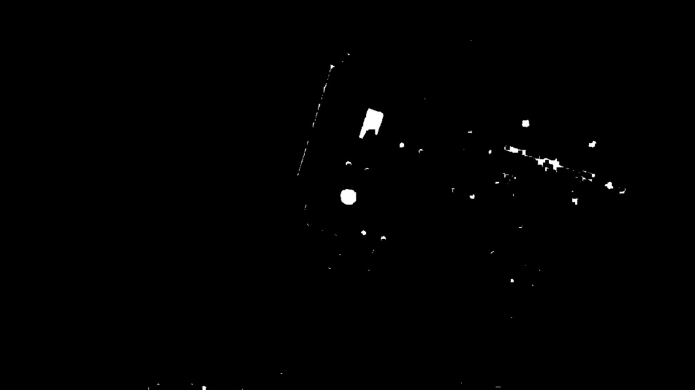
  
  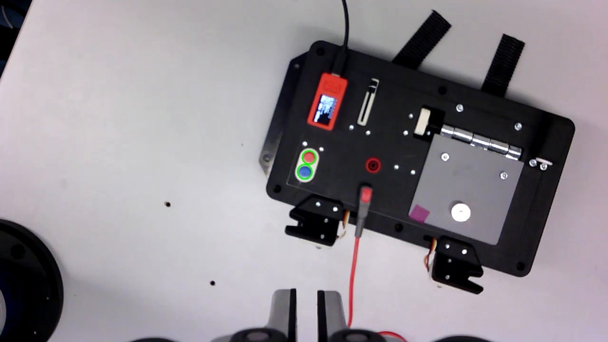
</p>

#### Pressing the button
1. Based on the detected board origin, the arm is moved to a position just above the blue button (i.e. the start trial button)
2. Using velocity control, the arm is moved slowly down until the vertical force felt at the end-effector exceeds a threshold. For more details about the force monitoring see [Force monitoring](#force-monitoring).
3. The arm is moved back up

### Task 2: Move slider to setpoints
1. The arm is moved above the initial location of the slider, and moved down until contact with the board
2. The arm moves the slider all the way to the end with one finger, then moves it back to its original position.
3. Forces are monitored during the slide to determine the end of the slider's path.

### Task 3: Plug probe in test port
#### Grasp plug
To successfully grasp the plug from the board, the arm first moves above the plug and then uses visual servoing to align itself with the plug. Once it is aligned, the arm moves down until it makes contact with the board. The gripper is then closed to firmly grasp the plug. Finally, the arm moves back up, carefully holding the plug.

The images below show the original image, thresholded mask image,  detected red circle (to align the arm), and final result of the visual servoing.

<p float="left">
  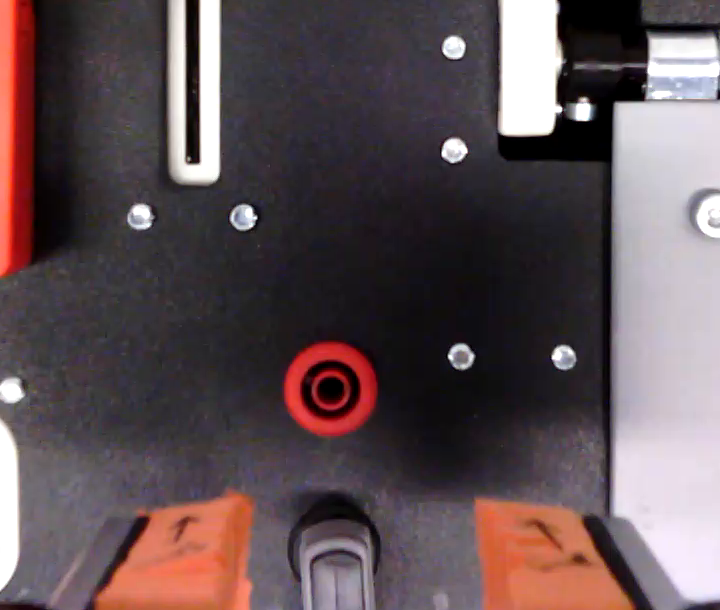
  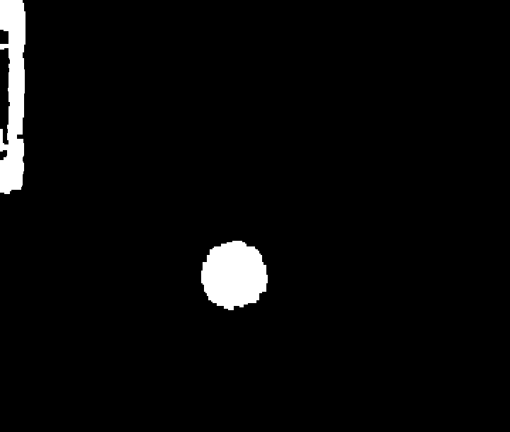
  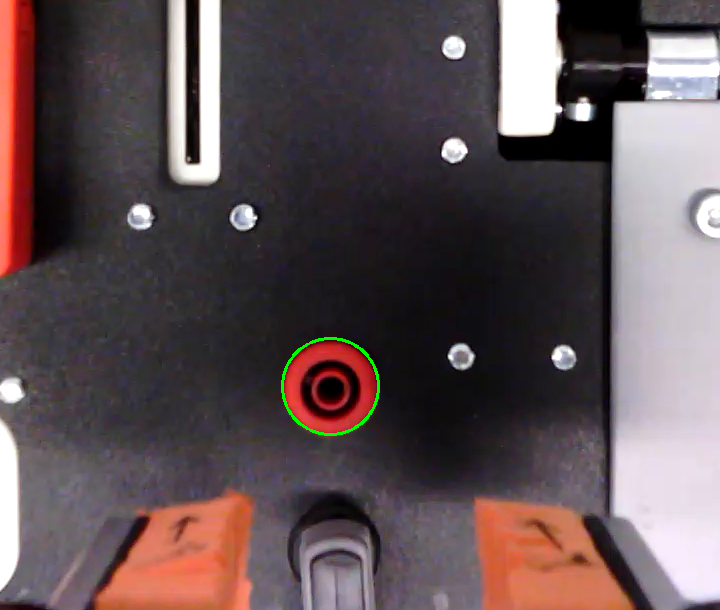
  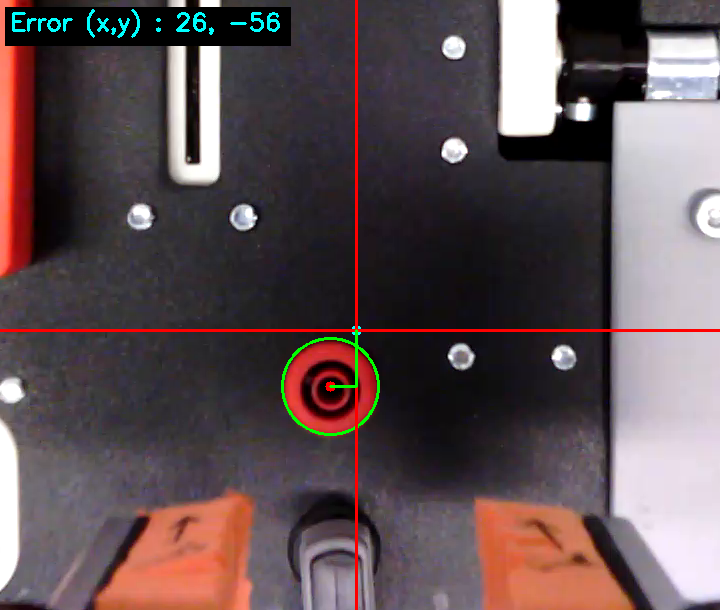
</p>

#### Insert plug in test port
To align with the red port, the robot first moves forward (with respect to its grasping position) for a fixed distance. To better align with the red port, visual servoing is performed using the ends of pairs of bolts on the board as targets.
The bolts are detected by applying adaptive thresholding on a cropped greyscale image, detecting circles, and selecting circles of equal sizes with an expected distance between their centers.
The images below show the original image, thresholded image, and the detected vertical (blue) and horizontal (green) pairs of circles. Red circles represent other detected circles which are rejected by the distance and pairing constraints.
The vertical pair of circles are used to align along the horizontal axis, and the horizontal pair for alignment along the vertical axis.

<p float="left">
  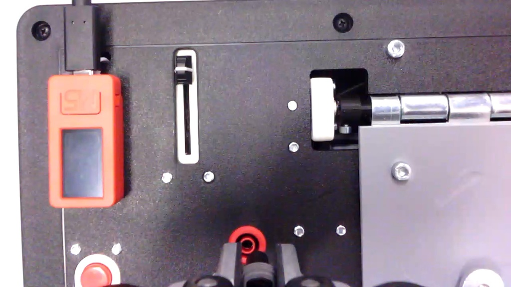
  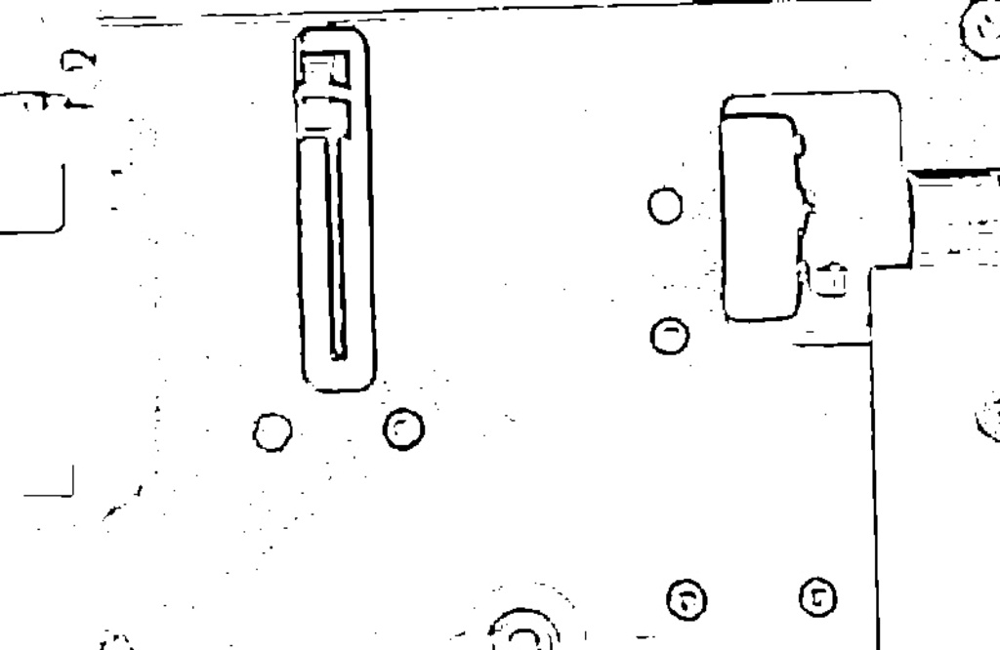
  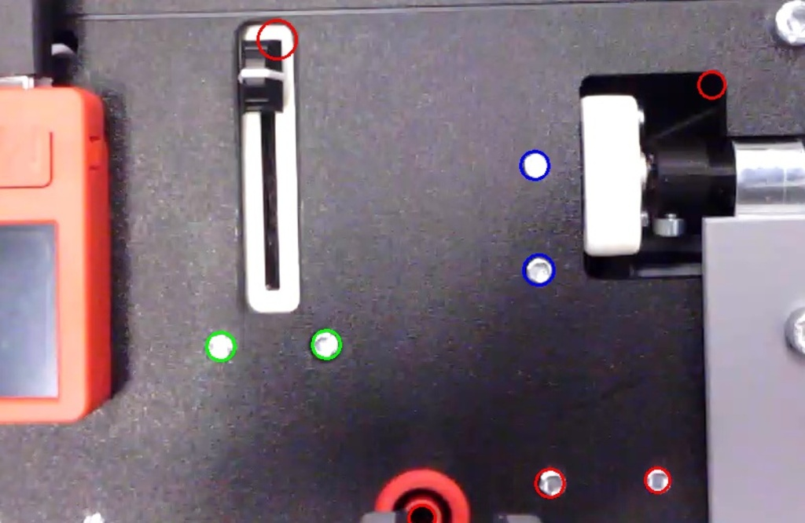
</p>

After alignment, the plug is inserted into the test port, by moving downwards with [force monitoring](#force-monitoring). This action is retried multiple times (with realignment) if it is detected that the plug has not been inserted (via a height and force threshold).

### Task 4: Open door and probe circuit
#### Open the door
The arm is moved above the door knob, based on the fixed transformation from the origin of the board. To align more precisely with the door knob, we detect the door knob with the following steps:
1. Crop a region of interest
2. Apply Canny edge detection
3. Detect contours
4. Find circles in the contour image using the Hough transform

The images below illustrate the result of the Canny edge detection, contour detection and the final detected door knob.

<p float="left">
  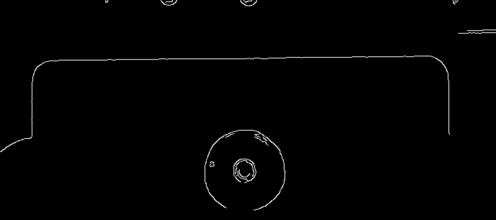
  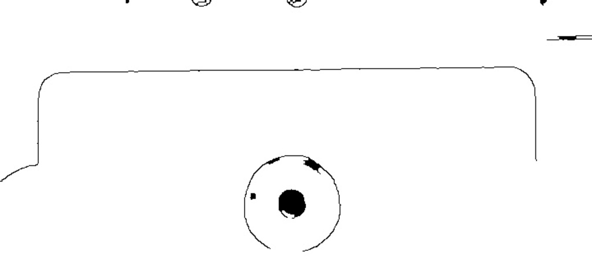
  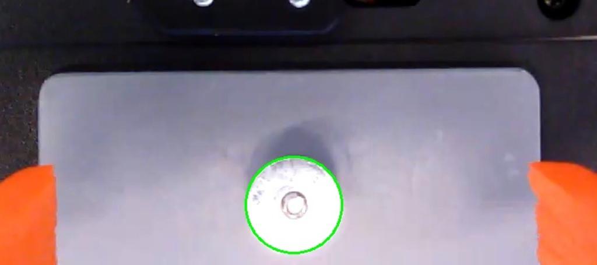
</p>
The robot arm is aligned with the door knob using visual servoing.

After alignment, the arm is moved down until contact with the door knob and retracted up to grasp the door knob. The door is opened by following a predefined trajectory, and the arm is retracted back to a safe position position.
#### Grasp and stow the probe
Due to the configuration of the gripper and camera, it is necessary to grasp the probe parallel to the fingers, instead of perpendicular to them. Therefore, the probe is removed from the board, and placed in the [3D printed holder](docs/3d_models/probe_holder_v3.STL), which is at a fixed location on the table.

#### Grasp probe and probe circuit
The probe is re-grasped such that it is parallel to the gripper fingers and moved to a position above the circuit to be probed.
Visual servoing is performed at this location, using as a target the orange square below the point to be probed.

<p float="left">
  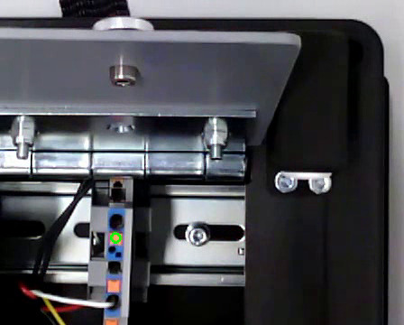
</p>

Once aligned, the probe is moved downwards at a slow velocity, and a height and force threshold is used to determine if the circuit was successfully probed. In case of a failure, the probed is moved back up, and probing is retried after realignment.
At the end of the task, the probe is placed back in the holder in preparation for wrapping the cable.

### Task 5: Wrap cable replace probe

#### Pick up cable

The arm moves above the cable to grasp it and then utilizes visual servoing to align itself with the cable. After successful alignment, the arm moves down and firmly grasps the cable by closing the gripper. The cable is grasped such that it is above the foam, and the zip tie loops around it. This allows the cable to slide through the zip tie, and the foam prevents it from falling down through the fingers.

The images below show the original image with the ROI rectangle, the Canny edge detection, the filtered contours, and the final result of the visual servoing.

<p float="left">
  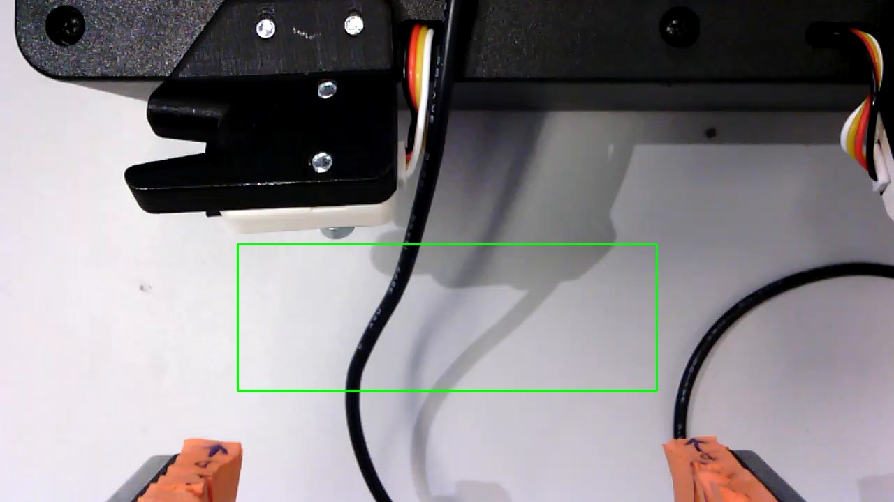
  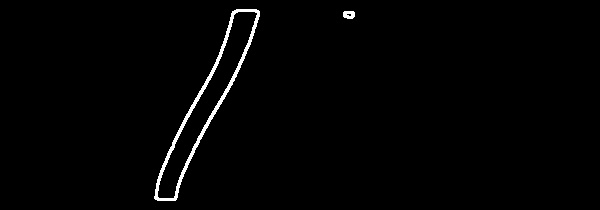
  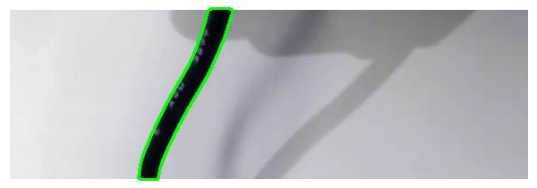
  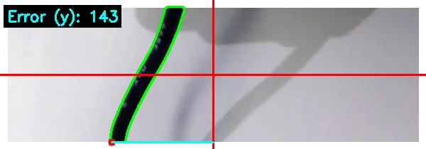
</p>

#### Wrap cable
Once the cable is grasped, the arm follows a pre-defined trajectory (with respect to the origin of the board) to wrap the cable around the two holders on the board. It is necessary for the cable to slide through the fingers during the trajectory, which is made possible by the zip tie being looped around it. Although this approach works if the cable is grasped correctly, it still leads to uncertain results. In our initial approach, we used the grooves in the foam to allow sliding and grasping as necessary; this approach was also not robust enough, in part because the foam degraded over time.

#### Re-place probe in board

When re-placing the probe back in the board, the arm is first moved above the location of the probe holder. Then, an inference is performed to detect the probe holder using a [YOLOv5-based](https://github.com/ultralytics/yolov5) trained model. The model is available for use and can be found at [here](models/probe_holder_horizontal). Once the probe holder is detected, the arm performs visual servoing to align with the holder. The aligned pose is saved before the arm grasps the probe from the 3D printed holder on the table (such that it is again perpendicular to the fingers), and approaches the previously saved pose. The probe is inserted in its holder by slowly approaching it using velocity control, and stopped based on force and distance thresholds.

<p float="left">
  
</p>


### Task 6: Press stop trial button
This task is identical to Task 1, with the exception that the robot aligns with and presses the red button to stop the trial.


### Force monitoring
The `kortex_driver` publishes an estimated wrench (force + torque) at the end-effector based on the sensed torques at each joint. The estimated wrench is quite noisy, and inaccurate since it does not consider the dynamics of the arm for the estimation. This means, for example, that the wrench fluctuates a lot during arm motions (especially at high accelerations), and can be different in different positions of the arm. Therefore, we only monitor this wrench at low velocities, and only consider the relative change in wrench. To detect a contact with the board (for example to press a button), we monitor the difference between the latest estimated force along the Z axis to the mean Z force for a fixed history. When the difference exceeds a threshold, the arm is stopped.

### Visual servoing
For several tasks, the robot arm needs to be accurately aligned with parts of the board to complete the task successfully. Since we assume there are inaccuracies in the initially estimated position of the board, we cannot fully rely on fixed transformation from the origin of the board. Therefore, we use visual servoing to align more accurately.

Visual servoing is only performed in the X-Y plane, and depending on the task we have a target element which we align to (e.g. the red port, door knob, etc.). For the task, we define the target position for the selected element, and move the arm in velocity control mode until the selected element is at the target position.

<p float="left">
  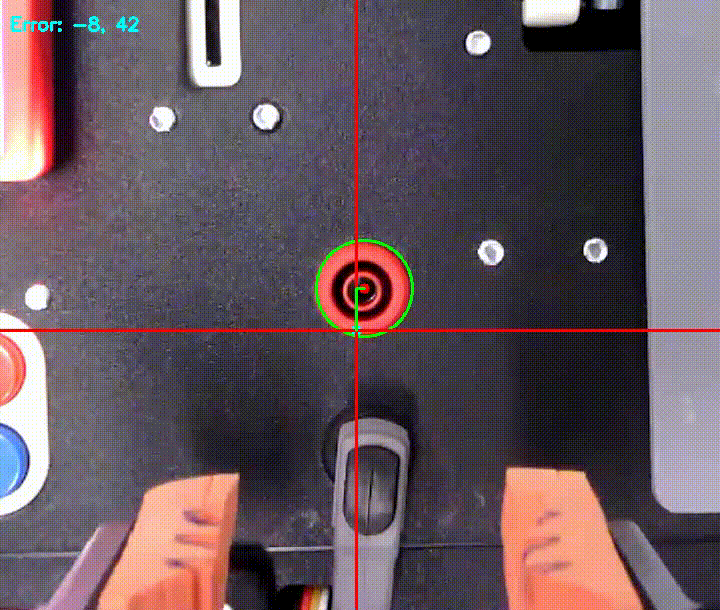
</p>

### Task sequence
An abstract class with the methods `pre_perceive`, `act` and `verify` is used as the base class for the implementation of each task. Each task therefore implements the three methods, with the main execution defined in the `act` method. A top-level script executes each task in sequence. The sequence of tasks can be changed via a ROS parameter (defined in [this](config/task_params.yaml) yaml file), allowing testing of individual tasks, and different sequences of tasks. All tasks depend on the localization of the board; therefore the top-level script first coordinates detection of the board before executing the task sequence. We would like to replace this implementation with a behaviour tree in the future to allow for more complex sequencing.

### Predefined trajectories
The `kortex_driver` accepts a sequence of Cartesian waypoints, and generates a trajectory through the waypoints with an optional blending radius. Cartesian waypoints are recorded with respect to the origin of the board for opening the door, and for winding the cable. At run time, the recorded waypoints are transformed with respect to the new origin of the board, and executed.

### Graphical user interface
To ease recording and replaying poses and trajectories a graphical user interface was developed. A more detailed description can be found in the [docs](docs/gui.md).

## Assumptions
Our software makes several implicit assumptions about the task, environment (including the board), the arm and the camera. We list some such assumptions below, which could cause a task failure if they don't hold true.

* The layout and dimensions of the board are identical to the one which we used. If any of the elements are moved significantly, most tasks would likely fail. Small changes in position would be less likely to cause task failures, since we use visual servoing in most cases.
* The initial state of the board is correct; i.e. the slider, plug, probe and door are all in their correct initial states.
* The red and blue buttons of the task board are in view of the camera at the initial pose of the arm. There is no failure recovery mechanism in case the buttons are not found.
* No other red/blue circle pairs are present in the view of the camera. If there are multiple pairs which match our criteria (e.g. roughly equal radius), we select the pair which are closest to each other. An improvement would be to verify whether other elements on the board align with our belief of the buttons' location.
* The camera is at a sufficient distance from the board, such that a point cloud is available at the location of the buttons. Since we rely on the 3D point cloud to retrieve the 3D pose of the buttons, the distance between the camera and the board needs to be within the depth range of the camera.

# Bring Your Own Devices (BYOD)

## Setup

TODO: add setup images

## Task description

TODO: add task description

## Requirements

  1. In terminal, run `export TESSDATA_PREFIX="<folder-path-to-the-trained-model>"`

## Launch

TODO: steps to launch the task

## References

<i>LCD-OCR</i>. (n.d.). <i>LCD-OCR</i>. Retrieved May 8, 2023, from https://github.com/DevashishPrasad/LCD-OCR

